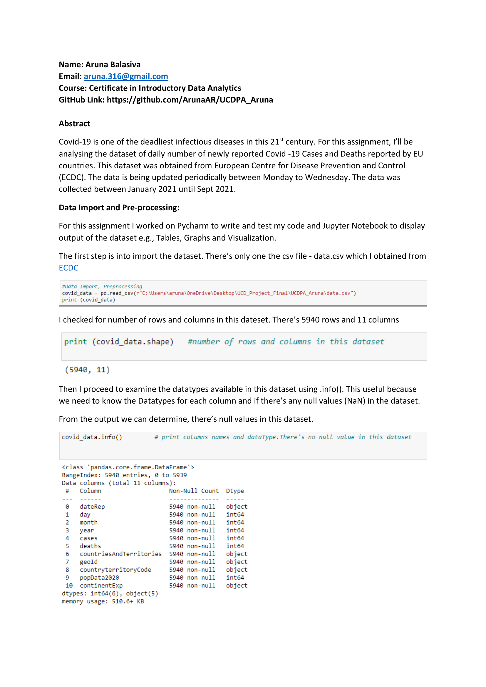

#  COVID-19 Cases & Deaths in the EU

This repository presents a detailed analysis of daily reported COVID-19 cases and deaths across EU countries between January and September 2021. The analysis includes data preprocessing, exploratory visualization, and trend interpretation.

---

##  Project Report

[](UCDPA_Aruna_Balasiva_Report.pdf)  
*Click the image above to view the full report (PDF format via GitHub’s viewer).*

---

<h2>Repository Structure</h2>
<pre>
├── UCDPA_Aruna_Balasiva_Report.pdf      # COVID-19 project report
├── report_preview.png                   # Preview of report’s first page
├── UCDPA_Aruna-Final.ipynb              # Jupyter Notebook with analysis & visualizations
├── data.csv                             # COVID-19 dataset from ECDC
├── main.py                              # (Optional) script version of analysis
├── requirements.txt                     # Python dependencies list (if present)
└── README.md                            # This file
</pre>


##  Project Overview

- **Dataset**: Acquired from the European Centre for Disease Prevention and Control (ECDC), covering new COVID-19 cases and deaths per day in EU countries.
- **Time Period**: January 2021 – September 2021.
- **Key Tasks**:
  - Data cleaning and ensuring data integrity.
  - Exploratory visualizations using Matplotlib, Seaborn, Plotly.
  - Country-based grouping and trend mapping.
  - Analysis highlights: cases & deaths trends, comparisons between countries (e.g., Ireland vs. Spain), insights into EU-wide patterns.

---

##  Key Insights

- Cases peaked at the beginning of 2021, with France, Spain, Italy, Germany, and Poland leading in total cases.
- Smaller nations like Liechtenstein, Iceland, Malta, and Luxembourg displayed high per-capita case counts.
- For deaths: Italy recorded the highest toll (>120,000), followed by France, Germany, and Spain. Ireland, Slovenia, and Lithuania had comparatively lower figures.
- Ireland saw about 219,000 cases in January, dropping until July, then rising slightly (3,033 cases on 22 August).
- Spain reached ~3 million cases and over 60,000 deaths by the end of February.
- Trend analysis via Plotly: interactive hover details like Spain’s 27,149 cases and 73 deaths on 28 July.

---

##  Technologies & Libraries

| Tool / Library             | Purpose                                      |
|----------------------------|----------------------------------------------|
| Python 3.x                 | Core programming language                    |
| Pandas, NumPy              | Data manipulation and analysis               |
| Matplotlib, Seaborn, Plotly| Visualization tools                          |
| Jupyter Notebook           | Interactive environment for exploration      |
| (Optional) main.py         | Script-based execution of analysis           |

---

##  How to Run This Project

1. Clone the repository:
   ```bash
   git clone https://github.com/ArunaAR/UCDPA_Aruna.git
